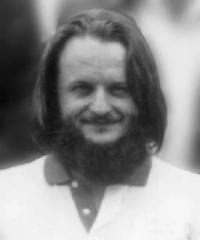
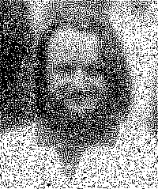

As I learned from [this article](https://hardmath123.github.io/conways-gradient.html), atavising is the art of "reversing" [Game of Life](https://en.wikipedia.org/wiki/Conway%27s_Game_of_Life) configurations. In the article, "differentiable automata" are used to atavise an image of Conway.

Nice! However, it seemed to me that a much simpler method would also work:

0. Start with some Game of Life configuration $C$
1. Flip a random pixel in $C$ and call the result $C'$
2. From $C'$, calculate the next configuration $D'$
3. Compute the distance between $D'$ and the target image $T$
4. If the distance $|D' - T|$ is less than $|D - T|$, set $C \leftarrow C'$
5. Go to step 1

The distance function applies a simple blurring kernel, gamma encoding, and taking the sum of the squares of the difference for each pixel. Because both the blurring kernel and computing the next Game of Life configuration only depend on pixels that are near the flipped pixel, we can get away with only computing the distance over a small section around the flipped pixel, and the whole process is reasonably efficient even without optimizations.

I wrote a simple C program that does this and displays the result using SDL. The code can be found on [GitHub](https://github.com/rubenvannieuwpoort/conlife). If I run the program for this target image:

The result converges to this within 10 seconds:

Which arguably is of higher quality than the atavised image obtained by using the differentiable automata:

Using a higher resolution image is entirely feasible. This is a 707 by 900 picture of Conway:

Even atavising multiple generations is feasible, although the quality degrades quickly with the number of generations. This is the same image, atavised 3 generations:

