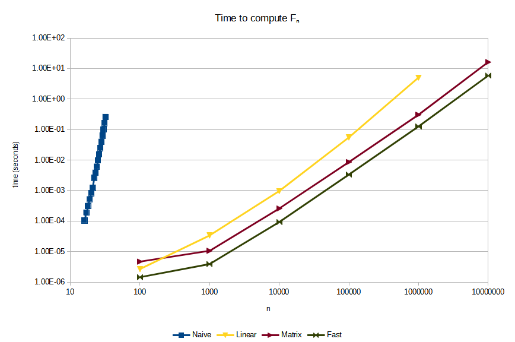

The *Fibonacci sequence* is defined as the sequence that satisfies the following properties:
  1. It starts with 0, 1
  2. Every subsequent term is the sum of the two preceding terms

So, it starts as 0, 1, 1, 2, 3, 5, 8, 13, ...

Mathematically, it is defined as
$$ \begin{aligned} F_0 &= 1\\ F_1 &= 1\\ F_n &= F_{n - 1} + F_{n - 2} \end{aligned} $$

Now, let's write a fast Python function to calculate the $n$th Fibonacci number. (Python is not normally a language I'd use to write something that needs to be fast, but this is just for fun. In this case I choose it because its built-in big number support is so convenient. It could also be written in, say, C++, although you'd need something like boost to provide the support for big numbers.)


## A naive implementation

Naively, we can code the mathematical definition into a recursive function:
```
def fibonacci_naive(n):
    if n <= 1:
        return n
    return fibonacci_naive(n - 1) + fibonacci_naive(n - 2)
```

However, it turns out that this is very slow, even just calculating $F_{35}$ already takes more than a second on my machine. Even worse, the runtime of `fibonacci_naive(n)` seems to increase very rapidly when we increase `n`: calculating $F_{38}$ already takes more than five seconds.

If we think about this function a bit, we can see that the only way the recursion can "end", is when it returns `0` or `1`. So to calculate $F_n$, at least $F_n$ function calls need to be made. Now, $F_n$ turns out to be exponential as a function of $n$. **The runtime of `fibonacci_naive(n)` is at least exponential in `n`.**


## A simple and fast implementation

Noting that
$$ (F_{n + 1}, F_n) = (F_n + F_{n - 1}, F_n) $$

we can come up with the following simple algorithm:
```
def fibonacci_linear(n):
    f_n, f_nm1 = 0, 1
    for _ in range(0, n):
        f_n, f_nm1 = f_n + f_nm1, f_n
    return f_n
```

This is blazing fast compared to the naive algorithm. Calculating $F_{10000}$, a number with 2090 digits, takes about a millisecond on my machine.

We note that the number of operations that `fibonacci_linear(n)` does is linear in `n`. However, since the length of the numbers involved is also linear in `n`, the runtime is quadratic. Usually you want to steer clear of quadratic algorithms, but this particular algorithm is probably good enough for most applications.


## Using matrices

If we really want to be a tryhard we can note that we can turn the recursive definition into a matrix equation:
$$ \left( \begin{matrix} F_n \\ F_{n - 1} \end{matrix} \right) = \left( \begin{matrix} 1 & 1 \\ 1 & 0 \end{matrix} \right)^n \left( \begin{matrix} F_0 \\ F_{-1} \end{matrix} \right)  $$

So now we want to calculate the exponential of a matrix. This can be done in $\log(n)$ operations by using the [Russian peasant algorithm](https://en.wikipedia.org/wiki/Ancient_Egyptian_multiplication#Russian_peasant_multiplication) (which is typically presented as an algorithm for multiplication, but it works for exponentiation as well if we replace the doubling by squaring and the addition by multiplication).

The idea is that to compute $x^n$ we loop over the bit positions `b = 0, 1, 2, ...` of `n` and keep $x^b$ in a variable `temp`. To find $x^{b+1}$, we can simply square $x^b$. Then we have an accumulator `acc` that is initialized to `1` (or the identity matrix, or whatever), and we multiply it by $x^b$ whenever the bit at position `b` in `n` is set. When the function terminates, we have
$$ x^{\sum_{k \in S(n)} 2^k} = x^n $$

in the accumulator variable `acc`. I used $S(n)$ to denote the bit positions that are `1` in the binary representation of $n$, so that $\sum_{k \in S(n)} 2^k = n$.

Putting this together we get
```
class Matrix:
    def __init__(self, a, b, c, d):
        self.a, self.b, self.c, self.d = a, b, c, d

    def __mul__(self, other):
        return Matrix(self.a * other.a + self.b * other.c,
                      self.a * other.b + self.b * other.d,
                      self.c * other.a + self.d * other.c,
                      self.c * other.b + self.d * other.d)


def russian_peasant_exponentiation(x, n, id):
    acc = id
    temp = x
    while n > 0:
        if n & 1:
            acc *= temp
        temp *= temp
        n >>= 1
    return acc


def fibonacci_matrix(n):
    fibonacci_matrix = Matrix(1, 1, 1, 0)
    identity_matrix = Matrix(1, 0, 0, 1)
    return russian_peasant_exponentiation(fibonacci_matrix, n, identity_matrix).b
```

Granted, this could be optimized further by inlining and simplifying things, but doing so would destory the whole idea of using a matrix, and we're going to simplify everything by using some mathematical identities anyway in the next section.


## Micro-optimizing using math

Now we note that
$$ \left( \begin{matrix} 1 & 1 \\ 1 & 0 \end{matrix} \right) = \left( \begin{matrix} F_2 & F_1 \\ F_1 & F_0 \end{matrix} \right) $$

and
$$ \left( \begin{matrix} 1 & 1 \\ 1 & 0 \end{matrix} \right) \left( \begin{matrix} F_{k + 1} & F_k \\ F_k & F_{k - 1} \end{matrix} \right) = \left( \begin{matrix} F_{k + 1} + F_k & F_k + F_{k - 1} \\ F_{k + 1} & F_k \end{matrix} \right) = \left( \begin{matrix} F_{k + 2} & F_{k + 1} \\ F_{k + 1} & F_k \end{matrix} \right) $$

We see here that the entry $F_{k + 1}$ in the right top of the right matrix is calculated as $F_k + F_{k - 1}$ even though $F_{k + 1}$ is already in the matrix on the left. From this we already see that the previous algorithm, which uses this exact algorithm, is not optimal.

From these two identities, it follows by induction that
$$ \left( \begin{matrix} 1 & 1 \\ 1 & 0 \end{matrix} \right)^n  = \left( \begin{matrix} F_{n + 1} & F_n \\ F_n & F_{n - 1} \end{matrix} \right) $$

Using $\left( \begin{matrix} 1 & 1 \\ 1 & 0 \end{matrix} \right)^{a + b}  = \left( \begin{matrix} 1 & 1 \\ 1 & 0 \end{matrix} \right)^a \left( \begin{matrix} 1 & 1 \\ 1 & 0 \end{matrix} \right)^b$ we see
$$ \left( \begin{matrix} F_{a + b + 1} & F_{a + b} \\ F_{a + b} & F_{a + b - 1} \end{matrix} \right)  = \left( \begin{matrix} F_{a + 1} & F_a \\ F_a & F_{a - 1} \end{matrix} \right) \left( \begin{matrix} F_{b + 1} & F_b \\ F_b & F_{b - 1} \end{matrix} \right) $$

Looking at the element in the left top and the element in the right bottom of the left and right side, we obtain the identities
$$ \begin{aligned} F_{a + b} &= F_{a + 1} F_b + F_a F_{b - 1} = F_a F_b + F_a F_{b - 1} + F_{a - 1} F_b \\ F_{a + b - 1} &= F_a F_b + F_{a - 1} F_{b - 1} \end{aligned} $$

If we set $a = b = k$ we get
$$ \begin{aligned} F_{2k} &= F_k^2 + 2 F_k F_{k - 1} \\ F_{2k - 1} &= F_k^2 + F_{k - 1}^2 \end{aligned} $$

Now, if we work with pairs of the form $G_k = (F_k, F_{k - 1})$, we know how to "double" the index (e.g. obtain $G_{2k}$ from $G_k$), and how to "add" (e.g., obtain $G_{a + b}$ from $G_a$ and $G_b$). So we can use the Russian peasant multiplication algorithm again. Factoring out some common expressions, we get:
```
def fibonacci_fast(n):
    acc = (0, 1)
    temp = (1, 0)
    while n > 0:
        if n & 1:
            square = acc[0] * temp[0]
            acc = (square + acc[0] * temp[1] + acc[1] * temp[0],
                   square + acc[1] * temp[1])
        square = temp[0] * temp[0]
        temp = (square + 2 * temp[0] * temp[1],
                square + temp[1] * temp[1])
        n >>= 1
    return acc[0]
```

And this is the fastest code I could write to calculate the Fibonacci numbers (in Python, that is). It's runtime should be comparable to the runtime `fibonacci_matrix` since it's still using the Russian peasant exponentiation scheme. However, it should be a bit faster since we got rid of a lot of overhead (function calls, lists, duplicate computations).


## Benchmarks

Note that **both axes are logarithmic**. In this type of graphs, graphs of the form $y = c x^d$ map to a straight line. Two graphs $y_a = c_a x^{d_a}$ and $y_b = c_b x^{d_b}$ have the same slope if the exponents $d_a$ and $d_b$ are the same. They have a vertical offset if the constants $c_a$ and $c_b$ are different.



Some observations:
  - `fibonacci_naive` is so slow that it doesn't even make sense to compare it to the other methods
  - `fibonacci_linear` is much better, but it is still asymptotically slower than `fibonacci_matrix` and `fibonacci_fast` (although for small `n` -- say, smaller than 250, it might actually be faster)
  - `fibonacci_fast` is roughly 2.5 times as fast as `fibonacci_matrix`


## Update (2024-01-26)

The Youtube channel [Sheafification of G](https://www.youtube.com/@SheafificationOfG) published several video's on efficiently calculating the Fibonacci numbers. At the time of writing, there are three videos which can be found in [this playlist](https://www.youtube.com/playlist?list=PL3JI_Wj02ehVoNlvqVbCrxdwE2sWmDO8O). In the second video, it is mentioned how one commenter gave a tiny Python implementation that, surprisingly, is faster than the C++ implementation from the first video. Here is the Python implementation:
```
def fibonacci(n: int) -> int:
    def fib_pair(k: int) -> tuple[int, int]:
        if k <= 1:
            return (k, 1)
        fh, fh1 = fib_pair(k >> 1)
        fk = fh * ((fh << 1) - fh)
        fk1 = fh1**2 + fh**2
        if k & 1:
            fk, fk1 = fk1, fk + fk1
        return (fk, fk1)
    return fib_pair(n)[0]
```

This is just a manual transcription of the code that is shown in the video at [0:41](https://youtu.be/02rh1NjJLI4&t=42) with some slight modification in whitespace. I can't actually find where the code comes from, and for some reason you can't search in Youtube comments...

Notes:
  - `fk` is $F_k$.
  - `fh` is $F_{\lfloor \frac{k}{2} \rfloor}$, I guess the "h" stands for "half".
  - `fk1` is $F_{k + 1}$ and `fh1` is $F_{\lfloor \frac{k}{2} \rfloor + 1}$.

I quickly compared this to the code I gave in this post and was pleased to see that this code uses the same idea, although I have to admit that this code is both more elegant and runs noticeably quicker. The differences are:
  - It doesn't use the "accumulator" approach, but uses a more elegant recursive approach.
  - It uses the recursion for $F_{k + 1}$ and $F_{2k + 1}$ instead of for $F_k$ and $F_{2k - 1}$ like I do.
  - It uses the exponentation operator (`**`) instead of multiplication, and does some algebraic tricks to write `fh**2 + 2 * fh * (fh1 - fh)` as `fh * ((fh << 1) - fh)` to get rid of one multiplication.

All in all a worthy winner! I always believed that the "accumulator" approach was the fastest way to implement a Russian-peasant-style algorithm, and it's interesting to see this proven wrong.


## Update (2024-01-27)

After thinking about this a bit more, I came up with the following version with is both shorter and faster:

```
def fibonacci_faster(n: int) -> int:
    fk1, fk = 1, 0
    for b in range(n.bit_length() - 1, -1, -1):
        f2k1, f2k = fk**2 + fk1**2, fk * (fk + (fk1 << 1))
        fk1, fk = (f2k, f2k + f2k1) if n & (1 << b) else (f2k1, f2k)
    return fk
```

It works by calculating either $F_{2k}$, $F_{2k+1}$ or $F_{2k + 1}$, $F_{2k + 2}$, based on if the `b`th bit of the binary expansion of `n` is set. After the $m$th iteration, `fk` will equal $F_{n_m}$, where $n_m$ is the number that consists of the $m$ most significant bits of `n`.

Admittedly, it's not as nice to read as the rescursive version.
