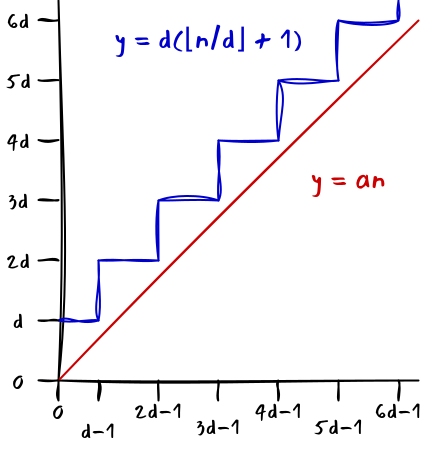
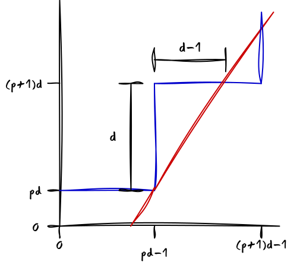

{
    "title": "Division by constant integers",
    "description": "Most modern processors have an integer divide instruction which is relatively slow compared to the other arithmetic operations. When the divisor is known at compile-time or the same divisor is used for many divisions, it is possible to transform the single division to a series of instructions which execute faster. Most compilers will optimize divisions in this way. In this article, I give an overview of the existing techniques for unsigned integers.",
    "date": "2025-04-07",
    "show": false
}

This post is a survey of the methods to optimize integer division by constants using multiplication. I will give a mathematically rigorous treatment and provide examples in assembly for various instruction set architectures.

## 1. Introduction

On modern processors, division typically has a significantly higher latency than multiplication. In floating-point arithmatic, it is a common optimization to multiply by the reciprocal $\frac{1}{c}$ instead of dividing by the constant $c$. A roughly analogous technique can be applied to integer division, although a lot of care needs to be taken to ensure that the result is valid in all cases.

### 1.1 Motivation

To make the idea more accessible, here's a contrived example using the decimal system. Suppose you have a simple calculator that supports multiplication but not division, and lets you compute with 6-digit integers. You have a list of numbers and want to find how many times 3 fits in each of the numbers.

Now, division by 3 is equivalent to multiplication by 0.3333... Our calculator only supports integers, but we can multiply by 333 and divide by 1000 and round down by discarding the last three digits. We expect that this gives us an approximately correct answer. However, we see that for 3, this procedure already fails, since after multiplying by 333 we are left with 999, which gives 0 when the last three digits are discarded.

One way to modify our method is to round up the constant we are multiplying by to 334. This seems to give the correct answer, even for larger numbers. This is what we'll call the *round-up method*. Another method is to simply increase the dividend by 1 before the multplication by 333. This is what we'll call the *round-down* method.

This is very close to how compilers optimize division by integer constants. The hard part is to figure out for what inputs the method produce correct results, so that we can pick the most efficient method that is correct for all possible inputs.

### 1.2 Overview

In the remainder of the article, I will assume that we are evaluating the rounded quotient $\frac{n}{d}$ where $n$ and $d$ are integers. Here, $n$ is called the *dividend* and $d$ is the *divisor*. We assume $d$ to be nonzero.

I assume a processor that supports efficient instructions to form the full $2N$-bit product of two $N$-bit operands, as well as additions, subtractions, and bit shifts. I will give examples in assembly language for x86, x86_64, and RISC-V.

The semantics of division in the C programming language are following, meaning that for division of unsigned integers the quotient is rounded down and for division of signed integers, the quotient is rounded towards zero. Mixed division, where the dividend is signed and the divisor is unsigned, but should be easy to implement with the techniques presented in this article.

In section 2 I will consider the case of unsigned division, where we optimize the evaluation of the quotient $\lfloor \frac{n}{d} \rfloor$ for integers $0 \leq n, d < 2^N$. In section 3 I will consider the case of signed division, where we optimize the evaluation of the quotient $[ \frac{n}{d} ]$ for integers $-2^{N-1} \leq n, d < 2^{N-1}$.

## 2. Unsigned integers

### 2.1 Theory

Following the idea presented in the motivation, we are looking to optimize the evaluation of $\lfloor \frac{n}{d} \rfloor$ as $\lfloor \frac{mn}{2^k} \rfloor$, where $m \approx \frac{2^k}{d}$. The expression $\lfloor \frac{mn}{2^k} \rfloor$ can be efficiently evaluated by a multiplication followed by a bit shift.

The expression $\frac{mn}{2^k}$ will be closer to $\frac{n}{d}$ when $k$ is larger, so we are looking to maximize $k$, while still ensuring that $m < 2^N$ so that $m$ fits in a single $N$-bit word. The following result tells us that how this can be achieved.

**Theorem 1**: *Let $0 < d < 2^N$ be an integer and let $\ell = \lfloor \log_2(d) \rfloor$. Then*
$$ \lceil \frac{2^{N + \ell}}{d} \rceil < 2^N $$

**Proof**: It suffices to prove that $\frac{2^{N + \ell}}{d} \leq 2^N - 1$. We can use $2^\ell = 2^{\lfloor \log_2(d) \rfloor} = d - q$ where $q$ is an integer with $1 \leq q < d$. The resulting expression simplifies to $d \leq q \cdot 2^N$, which obviously holds since $d < 2^N \leq q \cdot 2^N$.

$\square$

With this out of the way, we are ready to derive some more interesting results. As mentioned in the motivation, there are two methods that we can apply:
  - The *round-up method*, where we pick $m = \lceil \log_2(d) \rceil$ and evaluate the quotient $\lfloor \frac{n}{d} \rfloor$ as $\lfloor \frac{mn}{2^{N+\ell}} \rfloor$ 
  - The *round-down method*, where we pick $m = \lfloor \log_2(d) \rfloor$ and evaluate the quotient $\lfloor \frac{n}{d} \rfloor$ as $\lfloor \frac{m(n + 1)}{2^{N+\ell}} \rfloor$

In the following two sections I will derive when equality holds for these methods.

### Round-up method

We will need the following lemma.

**Lemma 2**: *Suppose that $n$ and $d$ are integers with $d > 0$, and $x$ is a real number. If $\frac{n}{d} \leq x < \frac{n + 1}{d}$ then $\lfloor x \rfloor = \lfloor \frac{n}{d} \rfloor$.*

**Proof**: We have $\frac{n}{d} \leq x < \frac{n + 1}{d} \leq \lfloor \frac{n}{d} \rfloor + 1$. After taking the floor of all terms and considering that the right-hand side is an integer, we get $\lfloor \frac{n}{d} \rfloor \leq \lfloor x \rfloor < \lfloor \frac{n}{d} \rfloor + 1$, which implies $\lfloor x \rfloor = \lfloor \frac{n}{d} \rfloor$.

$\square$

The following result is due to TODO and gives a sufficient condition for when the round-up method will produce a correct result.

**Theorem 2**: *Let $d$, $m$, $\ell$ be nonnegative integers with $d \neq 0$ and*
$$ 2^{N + \ell} \leq d \cdot m \leq 2^{N + \ell} + 2^\ell \tag{1} $$

*then $\lfloor \frac{mn}{2^{N + \ell}} \rfloor = \lfloor \frac{n}{d} \rfloor$ for every integer $n$ with $0 \leq n < 2^N$*.

**Proof**: Multiplying the inequality by $\frac{n}{d \cdot 2^{N + \ell}}$ we get $\frac{n}{d} \leq \frac{mn}{2^{N + \ell}} \leq \frac{n}{d} + \frac{1}{d} \cdot \frac{n}{2^N}$. We have $n < 2^N$, so that $\frac{n}{2^N} < 1$. It follows that $\frac{n}{d} \leq \frac{mn}{2^{N + \ell}} < \frac{n}{d} + \frac{1}{d}$. By lemma 2, it follows that $\lfloor \frac{mn}{2^{N + \ell}} \rfloor = \lfloor \frac{n}{d} \rfloor$ for all integers $n$ with $0 \leq n < 2^N$.

This test can be efficiently implemented modulo $2^N$, by testing if $d \cdot m$ (evaluated modulo $2^N$) is less than or equal to $2^\ell$.

However, the bound is not tight. For example, for $N = 31$, $d = 3$, the test fails, but still $\lfloor \frac{mn}{2^{N+\ell}} \rfloor = \lfloor \frac{n}{d} \rfloor$ for every integer $0 \leq n < 2^N$.

The following theorem, which is my own work, does provide a sharp bound.

**Theorem 3**: *Let $k$ and $d$ be positive integers with $d^2 < 2^k$ and where $d$ is not a power of two, and $m = \lceil \frac{2^k}{d} \rceil$. Then there exists an integer $p > 0$ such that*
- *$\lfloor \frac{mn}{2^k} \rfloor \neq \lfloor \frac{n}{d} \rfloor$ for any $n = p'd - 1$ with $p' > p$*
- *$\lfloor \frac{mn}{2^k} \rfloor = \lfloor \frac{n}{d} \rfloor$ for any $0 \leq n < pd - 1$*

**Proof**: We have $\lfloor \frac{mn}{2^k} \rfloor = \lfloor \frac{n}{d} \rfloor$ when $\lfloor \frac{n}{d} \rfloor \leq \frac{mn}{2^k} < \lfloor \frac{n}{d} \rfloor + 1$. We have $\lfloor \frac{n}{d} \rfloor \leq \frac{n}{d} = \frac{(\frac{2^k}{d}) n}{2^k} \leq \frac{\lceil \frac{2^k}{d} \rceil n}{2^k} = \frac{mn}{2^k}$ so $\lfloor \frac{n}{d} \rfloor \leq \frac{mn}{2^k}$ holds.

We now consider when the inequality $\frac{mn}{2^k} < \lfloor \frac{n}{d} \rfloor + 1$. Substituting $m = \lceil \frac{2^k}{d} \rceil$ and multiplying by $d$ gives us
$$ \alpha n < d (\lfloor \frac{n}{d} \rfloor + 1) $$

where $\alpha = \frac{d}{2^k} \lceil \frac{2^k}{d} \rceil$. Consider the graph of the functions $y = \alpha n$ and $y = d(\lfloor \frac{n}{d} \rfloor + 1)$:

Now, $\lim_{n \rightarrow \infty} \frac{d(\lfloor \frac{n}{d} \rfloor + 1)}{n} = 1$, while $\lim_{n \rightarrow \infty} \frac{\alpha n}{n} = \alpha > 1$, so at some point the graphs must cross. Moreover between $n = pd - 1$ and $n = (p + 1)d - 1$ the function $y = \alpha n$ will increase faster than $y = d(\lfloor \frac{n}{d} \rfloor + 1)$. So if we can show that the smallest $n$ where $\alpha n > d(\lfloor \frac{n}{d} \rfloor + 1)$ is of the form $n = pd - 1$, we are done.

Suppose that this is not the case. Then we have the following situation:

This implies that the slope of the red line must be steeper than $\frac{d}{d-1}$, so we have $\alpha > \frac{d}{d - 1}$. However, we assumed that $d < 2^k$, so that we have $d(d - 1) < d^2 < 2^k$. Adding $(d-1)2^k$ and dividing by $d(d-1)$, we find $\frac{2^k}{d} + 1 < \frac{2^k}{d - 1}$. Since the left side is larger than $\lceil \frac{2^k}{d} \rceil$, we have $\lceil \frac{2^k}{d} \rceil < \frac{2^k}{d - 1}$ and after multiplying by $\frac{d}{2^k}$ we find
$$ \alpha < \frac{d}{d - 1} $$

We saw before that $\alpha > \frac{d}{d - 1}$, so we have a contradiction, and our assumption that $n$ is not of the form $n = pd - 1$ must be false.

$\square$

Note that when $k = N + \lceil \log_2(d) \rceil$ and $d < 2^N$ we have $d^2 < 2^k$.

It is also possible to directly compute the bound for a given value of $m$.

TODO
